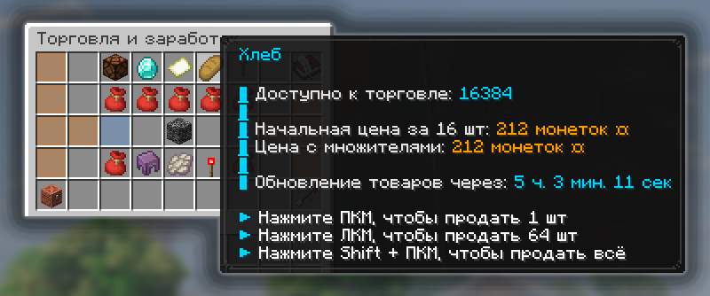
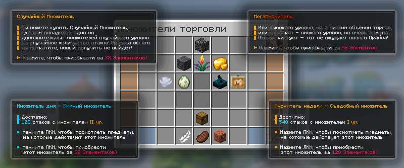
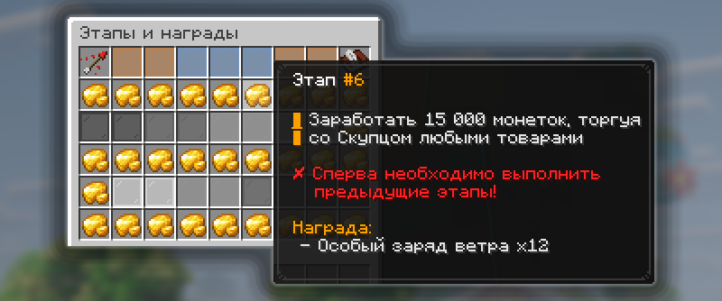

# Скупец

Скупец – это система выгодной продажи игровых ресурсов в обмен на валюту «монетки» и выполнение ежедневных заданий для увеличения своего заработка.

## Как открыть Скупца

<figure><figcaption></figcaption></figure>

Меню Скупца доступно по команде `/b` или `/buyer`, а также через НПС на спавне с именем «Скупец».

## Торговля

### Как продавать ресурсы

<figure><figcaption></figcaption></figure>

Продавать ресурсы можно, открыв вкладку «Торговля» в главном меню Скупца `/b`. Скупец будет предлагать **15 различных товаров**, которые он может купить у вас. Найдите подходящий вам товар и нажмите ПКМ по нему, имея этот ресурс в инвентаре у себя.


Товары имеют две категории редкости: обычные и особые. Редкость товара влияет на таймер обновления этого торга и сложность добычи:

* **обычные торги** обновляются **раз в 6 часов**.
* **особые торги** обновляются **раз в 8 часов**.



Имея при себе достаточно Элементов или Гемов, вы можете обновить торги у Скупца.

* обновить **обычные торги** – 1 Элемент или 49 Гемов.
* обновить **особые торги** – 4 Элемента или 69 Гемов.

Обновить торги можно во вкладке «Торговля» в главном меню Скупца `/b` на иконке «Обновить ассортимент предложений».



Скупец может принять у вас только ограниченное количество одного товара. Узнать подробнее можно на иконке ресурса.


Товары, которые может принимать Скупец

| Категория               | Товары                                                                                                                                                                                                                                                                                                                                                                                                                                                                                                                                                                                                                                                                                                                                                                                                                                                                                                                                                                                                                                                                                                                                                                                                                                                                                                                                                                                                 |
| ----------------------- | ------------------------------------------------------------------------------------------------------------------------------------------------------------------------------------------------------------------------------------------------------------------------------------------------------------------------------------------------------------------------------------------------------------------------------------------------------------------------------------------------------------------------------------------------------------------------------------------------------------------------------------------------------------------------------------------------------------------------------------------------------------------------------------------------------------------------------------------------------------------------------------------------------------------------------------------------------------------------------------------------------------------------------------------------------------------------------------------------------------------------------------------------------------------------------------------------------------------------------------------------------------------------------------------------------------------------------------------------------------------------------------------------------ |
| Лут из враждебных мобов | Роза визера, Череп визер-скелета, Редстоуновая пыль, Нить, Эндер-жемчуг, Тотем бессмертия, Стрела, Стрела замедления, Стрела отравления, Стрела слабости, Гнилая плоть, Паучий глаз, Уголь, Кость, Сгусток слизи, Огненный стержень, Вихревой стержень, Панцирь шалкеры, Порох, Сгусток магмы, Слеза гаста, Мембрана фантома.                                                                                                                                                                                                                                                                                                                                                                                                                                                                                                                                                                                                                                                                                                                                                                                                                                                                                                                                                                                                                                                                          |
| Лут из мирных мобов     | Белая шерсть, Черепашье яйцо, Яйцо нюхача, Снежок, Яйцо, Коричневое яйцо, Синее яйцо, Жареная говядина, Жареная свинина, Жареная баранина, Жареная курятина, Жареная крольчатина, Жареная треска, Жареный лосось, Тропическая рыба, Иглобрюх, Бутылочка мёда, Перо, Кожа, Шкурка кролика, Пчелиные соты, Чернильный мешок, Светящийся чернильный мешок, Черепаший щиток, Щиток броненосца, Кроличья лапка.                                                                                                                                                                                                                                                                                                                                                                                                                                                                                                                                                                                                                                                                                                                                                                                                                                                                                                                                                                                             |
| Блоки                   | Дубовое бревно, еловое бревно, берёзовое бревно, тропическое бревно, акациевое бревно, бревно тёмного дуба, мангровое бревно, вишнёвое бревно, бледное дубовое бревно, блок бамбука, багровый стебель, искажённый стебель, камень, булыжник, замшелый булыжник, гранит, диорит, андезит, глубинный сланец, туф, кирпичи, утрамбованная грязь, смоляные кирпичи, песчаник, морской фонарь, призмарин, тёмный призмарин, незерак, незерские кирпичи, базальт, чернокамень, золочёный чернокамень, камень Края, пурпурный блок, железная цепь, блок изумруда, блок аметиста, медный блок, белая шерсть, терракота, стекло, блок травы, подзол, мицелий, грубая земля, дёрн, грязь, глина, гравий, песок, красный песок, лёд, плотный лёд, снежный блок, мох, бледный мох, кальцит, блок капельника, заострённый капельник, магма, обсидиан, плачущий обсидиан, багровый нилий, искажённый нилий, песок душ, почва душ, костяной блок, зарождающийся аметист, мангровые корни, губка, дыня, тыква, блок сена, блок пчелиных сот, блок слизи, блок смолы, скалк, паутина, красный фонарь, нотный блок, проигрыватель, стол зачарований, зельеварка, маяк, магнит, строительные леса, улей, книжная полка, резная книжная полка, кафедра, медный сундук, бочка, сундук Края, якорь возрождения, мишень, датчик дневного света, поршень, липкий поршень, раздатчик, выбрасыватель, сборщик, воронка, динамит. |
| Растительность          | Саженец дуба, саженец ели, саженец берёзы, саженец тропического дерева, саженец акации, саженец тёмного дуба, мангровый отросток, саженец вишни, саженец бледного дуба, коричневый гриб, красный гриб, багровый гриб, искажённый гриб, куст, сухой куст, факелцвет, кактусовый цветок, закрытый глазоцвет, открытый глазоцвет, роза визера, розовые лепестки, дикоцвет, спороцвет, куст светлячков, бамбук, тростник, кактус, плачущие лозы, вьющиеся лозы, лиана, растение-кувшин, цветок хоруса, семена пшеницы, какао-бобы, семена тыквы, семена дыни, семена свёклы, семена факелцвета, стручок растения-кувшина, светящиеся ягоды, сладкие ягоды, адский нарост, кувшинка, морская трава, морской огурец, ламинария, блок сушёной ламинарии, трубчатый коралл, мозговидный коралл, пузырчатый коралл, огненный коралл, роговой коралл, дыня, тыква, яблоко, ломтик дыни, плод хоруса, морковь, золотая морковь, картофель, ядовитый картофель, свёкла, пшеница.                                                                                                                                                                                                                                                                                                                                                                                                                                   |
| Драгоценности           | Блок изумруда, плачущий обсидиан, стол зачарований, кристалл Энда, маяк, проводник, магнит, сундук Края, якорь возрождения, редстоун, бирка, тотем бессмертия, золотое яблоко, золотая морковь, уголь, древесный уголь, необработанная медь, необработанное железо, необработанное золото, изумруд, лазурит, алмаз, кварц, осколок аметиста, медный слиток, железный слиток, золотой слиток, незеритовый лом, сверкающий ломтик арбуза, слеза гаста, бутылочка опыта.                                                                                                                                                                                                                                                                                                                                                                                                                                                                                                                                                                                                                                                                                                                                                                                                                                                                                                                                  |
| Предметы версии 1.21    | Мангровое бревно, вишнёвое бревно, бледное дубовое бревно, блок бамбука, глубинный сланец, туф, утрамбованная грязь, смоляные кирпичи, блок аметиста, медный блок, свеча, дёрн, грязь, блок мха, блок бледного мха, кальцит, блок капельника, заострённый капельник, зарождающийся аметист, маленькая почка аметиста, средняя почка аметиста, большая почка аметиста, мангровые корни, мангровый отросток, саженец вишни, саженец бледного дуба, куст, факелцвет, кактусовый цветок, закрытый глазоцвет, открытый глазоцвет, розовые лепестки, дикоцвет, спороцвет, куст светлячков, растение-кувшин, яйцо нюхача, высохший гаст, семена факелцвета, стручок растения-кувшина, светящиеся ягоды, блок смолы, скалк, скалковая жила, громоотвод, светящаяся рамка, резная книжная полка, кафедра, медный сундук, сборщик, заряд ветра, коричневое яйцо, синее яйцо, необработанная медь, необработанное железо, необработанное золото, изумруд, осколок аметиста, медный слиток, комок смолы, светящийся чернильный мешок, щиток броненосца, стержень вихря, смоляной кирпич.                                                                                                                                                                                                                                                                                                                           |
| Некоторые товары        | Высохший гаст, скалковая жила, паутина, факел, факел душ, медный факел, редстоуновый факел, фонарь, фонарь душ, медный фонарь, стержень Края, красный фонарь, костёр, костёр душ, нотный блок, проигрыватель, стол зачарований, кристалл Энда, зельеварка, колокол, громоотвод, цветочный горшок, стойка для брони, рамка, светящаяся рамка, картина, книжная полка, крюк-растяжка, датчик дневного света, поршень, липкий поршень, раздатчик, выбрасыватель, сборщик, воронка, рельсы, энергорельсы, динамит, ведро, огненный заряд, поводок, карта, заряд ветра, спектральная стрела, хлеб, печенье, торт, тыквенный пирог, кремень, глиняный шар, осколок призмарина, кристалл призмарина, раковина наутилуса, смоляной кирпич, книга, стеклянная бутылочка, светопыль, порох, дыхание дракона, маринованный паучий глаз, сахар.                                                                                                                                                                                                                                                                                                                                                                                                                                                                                                                                                                    |

### Множители монеток

<figure><figcaption></figcaption></figure>

На многие товары может действовать множитель. Они могут быть 1, 2 и 3 уровней, прибавляя к стоимости товаров по 5%, 10% и 15% соответственно.

Способы получения множителей:

1. Имея при себе достаточно Элементов, вы можете приобрести **Множитель дня за 32 Элемента** или **Множитель недели за 128 Элементов** на категорию товаров, которая действует сейчас.
2. Если у вас есть 32 Элемента, вы можете купить Случайный Множитель. Множитель может  быть на разные товары, и их количество тоже будет случайным.
3. Выполняя Ежедневную сделку, в качестве награды вам может попасться случайный множитель.
4. За прохождение разных Этапов при торговле у Скупца в качестве награды вы можете получить множитель.


Множители не имеют таймеров на использование. Вы можете воспользоваться им в любое время, пока у вас не закончится количество продаж на активные категории.


## Этапы и награды

<figure><figcaption></figcaption></figure>

Этапы у Скупца похожи на своеобразный боевой пропуск, но здесь есть только одна цель — это **зарабатывать монетки у Скупца**. Каждый новый этап требует всё больше заработать монеток.


За прохождение каждого этапа у Скупца вы получаете вознаграждение в виде каких-то ресурсов или множителя.


## Ежедневная сделка

<figure><figcaption></figcaption></figure>

Каждый день Скупец предлагает выполнить одну сделку с ним, которая заключается в заработке монеток на определенной категории товаров. В качестве вознаграждения вы получите одну случайную награду из списка.

### Показатель ежедневности

**Показатель ежедневности** — это система прогресса, связанная с выполнением ежедневных сделок. Он состоит из **12 делений** и изначально равен 0.


За заполнение делений показатель ежедневности повышает уровень ежедневных сделок: чем больше заполнено делений, тем **сложнее становятся задания**, но тем **ценнее становятся возможные награды**. Конкретная награда выбирается случайно из набора, соответствующего текущему уровню показателя.



Показатель ежедневности увеличивается за выполнение ежедневных сделок: после первой выполненной сделки заполняется первое деление, а затем новое деление добавляется за каждые две выполненные сделки. Всего показатель можно увеличить до **12**.


Награды за показатель ежедневности

| Уровень показателя | Возможные награды                                                                                                             |
| ------------------ | ----------------------------------------------------------------------------------------------------------------------------- |
| 1                  | 10 000 монеток, 20 гемов, 32 крупицы, Ключ испытаний, Сомнительный разящий клинок, Множитель на всё I ур. ×64                 |
| 2                  | 20 000 монеток, 25 гемов, 48 крупиц, Ключ испытаний, Сомнительный разящий клинок, Множитель на всё I ур. ×96                  |
| 3                  | 30 000 монеток, 30 гемов, 64 крупицы, Ключ испытаний, Сомнительный разящий клинок II, Множитель на всё I ур. ×128             |
| 4                  | 40 000 монеток, 35 гемов, 8 Элементов, Ключ испытаний, Сомнительная эффективность, Множитель на всё I ур. ×192                |
| 5                  | 50 000 монеток, 40 гемов, 10 Элементов, Зловещий ключ испытаний, Сомнительная эффективность, Множитель на всё II ур. ×64      |
| 6                  | 60 000 монеток, 45 гемов, 12 Элементов, Зловещий ключ испытаний, Сомнительная эффективность II, Множитель на всё II ур. ×128  |
| 7                  | 70 000 монеток, 50 гемов, 14 Элементов, Зловещий ключ испытаний, Сомнительная удача, Множитель на всё II ур. ×128             |
| 8                  | 80 000 монеток, 55 гемов, 16 Элементов, Зловещий ключ испытаний, Сомнительная удача, Множитель на всё II ур. ×192             |
| 9                  | 90 000 монеток, 60 гемов, 18 Элементов, Особый ключ испытаний, Сомнительная удача II, Множитель на всё III ур. ×64            |
| 10                 | 100 000 монеток, 65 гемов, 20 Элементов, Особый ключ испытаний, Сомнительная добыча, Множитель на всё III ур. ×128            |
| 11                 | 110 000 монеток, 70 гемов, 22 Элемента, Особый ключ испытаний, Сомнительная добыча, Множитель на всё III ур. ×128             |
| 12                 | 125 000 монеток, 75 гемов, 24 Элемента, Особый зловещий ключ испытаний, Сомнительная добыча II, Множитель на всё III ур. ×192 |

